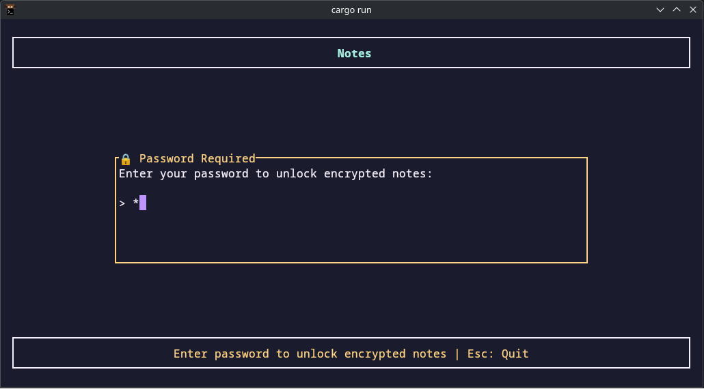
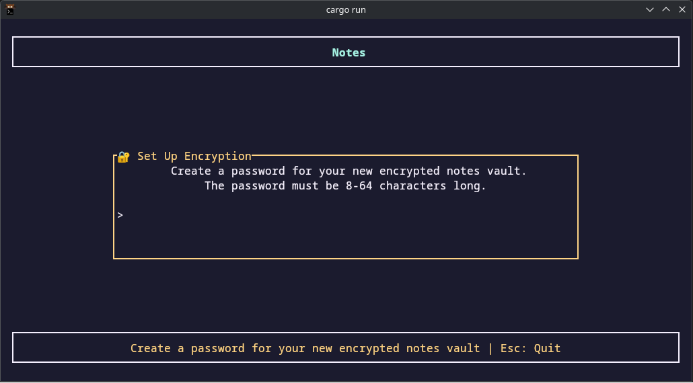
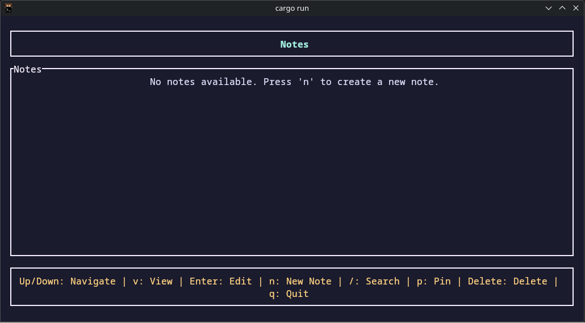
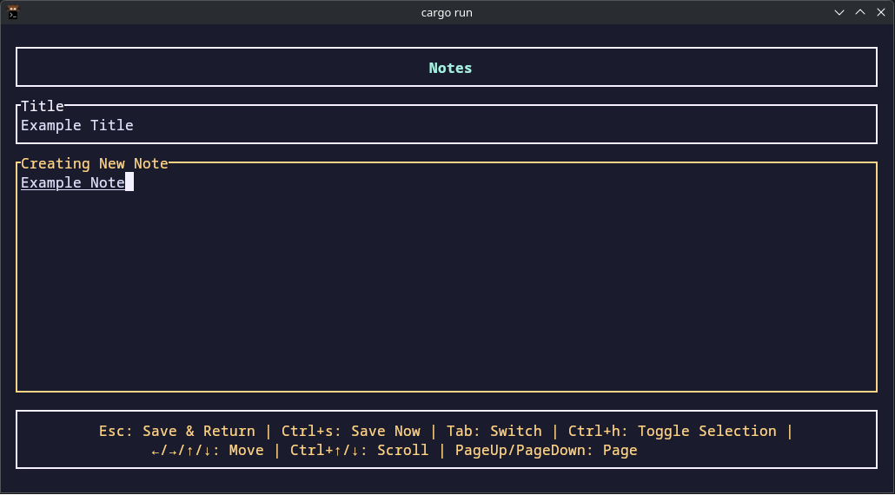

# tui-notes

A simple TUI-based Rust notes app.

## Features

- Create, edit, view, delete notes
- Search through your notes
- Customizable keybindings and colors
- (Optional) Note encryption using strong, modern algorithms

## Install

You need Rust. If you don't have it, visit: https://rustup.rs/

locally:
```bash
git clone https://github.com/zfi2/tui-notes.git
 
cd tui-notes

cargo build --release

./target/release/tui-notes
```

globally:
```bash
# after building
cargo install --path .

# or copy binary to your PATH
sudo cp ./target/release/tui-notes /usr/local/bin/

# then you can just
tui-notes
```

## Configuration

A default configuration file is created on the first start-up.
The configuration file is located in `~/.config/tui-notes/config.toml`.

## Default Keys

**Note list:**
- Up/Down: navigate
- Enter: edit note
- v: view note  
- n: new note
- /: search
- Delete: delete note
- q: quit

**Search:**
- Type stuff to search
- Up/Down: navigate results
- Enter or v: view result
- Esc: back to list

**Viewing:**
- Esc: back to list
- e: edit note
- Up/Down: scroll
- PgUp/PgDn: page up/down

**Editing:**
- Esc: save and back to list
- Tab: switch between title and content
- Enter in title: jump to content

## Why another notes app?

I wanted something fast that works in the terminal and doesn't have a thousand features I'll never use.

## Storage

Notes are stored in JSON (optionally encrypted), because it's simple, and you can read it without this app if you need to.
You may change the notes path in the configuration file, by default, the program saves relatively to wherever it got launched from.
You may configure it to use an absolute path, such as: `default_notes_file = "/home/user/.local/share/tui-notes/notes.json"`


## Screenshots

### Unlock Notes


### Encryption Prompt


### Main Menu


### Note Menu

## License

This project is licensed under the MIT License. See the [LICENSE](LICENSE) file for details.
